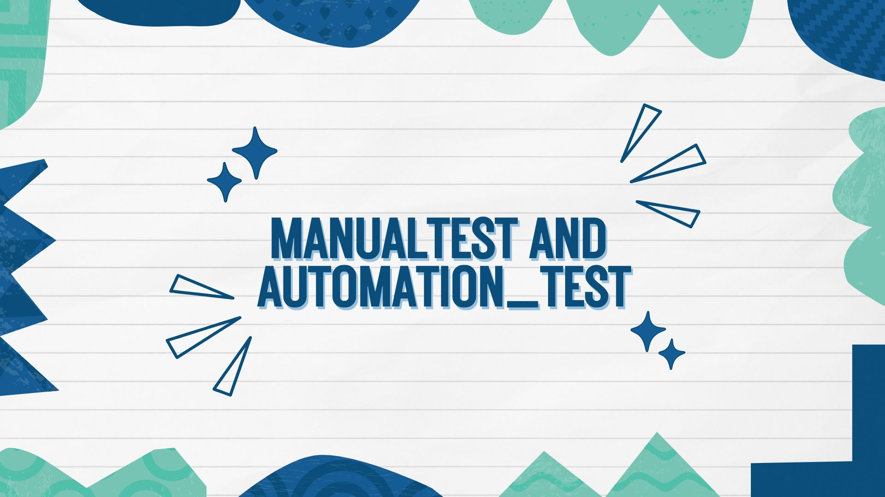
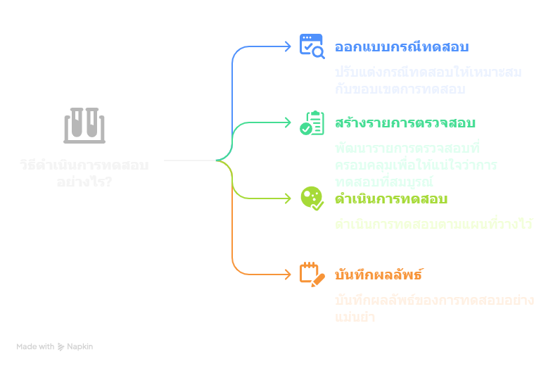
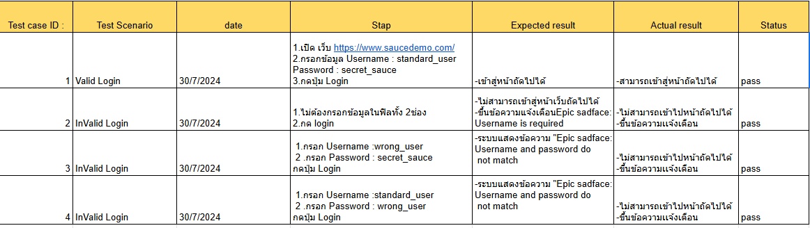
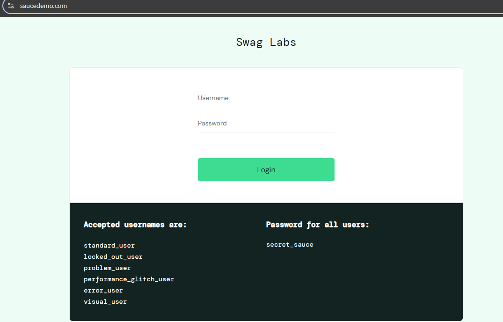
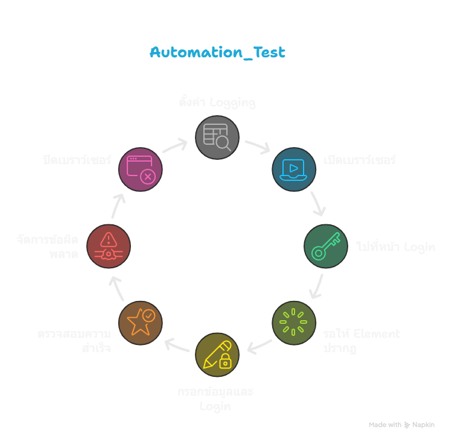
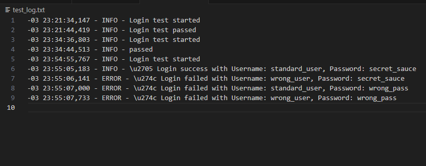

# Manual_test and Automation_Test





# อธิบายเป้าหมาย

" - ตรวจสอบความถูกต้องของ ระบบ Login ว่าทำงานตามที่คาดหวัง ทดสอบทั้ง Manual และ Automation 
-
"

# Tools (สำหรับ Automation_Test)
Python (ในตัวอย่างจะใช้ Version 3.13.1 / ระบบปฏิบัติการ windows 11)
Library ที่ต้องลงเพิ่ม
 - logging 
 - selenium and webdriver
 - pandas 
- Visual Studio Code

# Process

1. Manual test
2. Automation_Test


# 1. Manual test


- เราต้อง เตรียมแผนการทดสอบ (Test Plan)  กำหนดขอบเขตของการทดสอบ ให้ครบถ้วนและครอบคลุม Requirement
- ออกแบบกรณีทดสอบ (Test Case Design) แล้วแต่ความเหมาะสม ของขอบเขต
- สร้างรายการสิ่งที่ต้องตรวจสอบ เช่น
- กรอกข้อมูลถูกต้อง → ควรเข้าสู่ระบบได้
- กรอกข้อมูลผิด → ควรมีข้อความแจ้งเตือน
- ปุ่ม Login ทำงานถูกต้องหรือไม่
- ดำเนินการทดสอบ (Test Execution)
- ทดสอบแต่ละกรณีตามแผนที่วางไว้
- บันทึกผลลัพธ์ เช่น ผ่าน (Pass) หรือไม่ผ่าน (Fail)
จะใช้เงื่อนไขตามนี้

``` 

 ตรวจสอบว่า ระบบ Login ทำงานถูกต้อง
 ทดสอบกรณี ข้อผิดพลาด เช่น ข้อมูลผิด หรือ ช่องว่าง
 อุปกรณ์ที่ต้องใช้
 เว็บเบราว์เซอร์: Google Chrome 
 เว็บไซต์: [SauceDemo](https://www.saucedemo.com/)
 ข้อมูลล็อกอินสำหรับทดสอบ:
 Username ถูกต้อง: standard_user
 Password ถูกต้อง: secret_sauce
 Username ผิด: wrong_user
 Password ผิด: wrong_pass

``` 




# 2. Automation_Test

 จะช่วยในการทดสอบซอฟต์แวร์ แทนการทดสอบด้วย(Manual Test) เพื่อให้การทดสอบทำได้รวดเร็ว แม่นยำ (ใช้ในกรณีมีปริมาณมากๆ) โดยที่ จะใช้ทดสอบแบบเดียวกันกับ Manual Test 



```python
    import logging
    from selenium import webdriver
    from selenium.webdriver.common.by import By
    from selenium.webdriver.support.ui import WebDriverWait
    from selenium.webdriver.support import expected_conditions as EC

``` 




1. ตั้งค่า Loggin
🔹 ตั้งค่าการบันทึก log เพื่อเก็บผลลัพธ์ในไฟล์ test_log.txt พร้อมแสดงเวลาและระดับข้อความ
🔹 บันทึก "Login test" เพื่อระบุว่าเริ่มต้นการทดสอบ

```python
 logging.basicConfig(filename="test_log.txt", level=logging.INFO, format="%(asctime)s - %(levelname)s - %(message)s")
 logging.info("Login test started")

```
2. เปิดเว็บเบราว์เซอร์และไปที่หน้า Login 
🔹 เปิด Chrome WebDriver
🔹 ไปที่ SauceDemo เพื่อเตรียมทดสอบ Logi

```python
 driver = webdriver.Chrome()
 driver.get("https://www.saucedemo.com/")

```

3. รอให้ element ปรากฏ
🔹 ใช้ WebDriverWait เพื่อรอให้ Username และ Password ปรากฏก่อนดำเนินการ

```python
    username = WebDriverWait(driver, 10).until(
        EC.presence_of_element_located((By.NAME, "user-name"))
    )
    password = WebDriverWait(driver, 10).until(
        EC.presence_of_element_located((By.NAME, "password"))
    )

```


4. กรอกข้อมูลและกด Login
🔹 กรอกข้อมูล Username & Password
🔹 ค้นหา ปุ่ม Login และคลิกเพื่อลองเข้าสู่ระบบ

```python
    username.send_keys("standard_user")
    password.send_keys("secret_sauce")
    login_button = driver.find_element(By.ID, "login-button")
    login_button.click()
```


5. ตรวจสอบว่าการ Login สำเร็จ
🔹 บันทึก "passed" หากสำเร็จ หรือ "failed" หากไม่ผ่าน

```python
    if "inventory.html" in driver.current_url:
        logging.info("passed")
    else:
        logging.error("failed")

```


6. จัดการข้อผิดพลาด
🔹 หากเกิดข้อผิดพลาด บันทึกข้อความ Error เพื่อช่วยวิเคราะห์ปัญหา

```python
    except Exception as e:
        logging.error(f"Test encountered an error: {str(e)}")

```


7. ปิดเว็บเบราว์เซอร์
🔹 ปิด WebDriver หลังจากทดสอบเสร็จ

```python
    finally:
        driver.quit()

```
# ผลลัพธ์


# หากทำหลาย case พร้อมกันก็ใช้การ วน loop เอา

```python
    logging.basicConfig(filename="test_log.txt", level=logging.INFO, format="%(asctime)s - %(levelname)s - %(message)s")
    logging.info("Login test started")


    driver = webdriver.Chrome()
    driver.get("https://www.saucedemo.com/")


    test_cases = [
        ("standard_user", "secret_sauce"),  
        ("wrong_user", "secret_sauce"),     
        ("standard_user", "wrong_pass"),    
        ("wrong_user", "wrong_pass")        
    ]

    try:
        for username_data, password_data in test_cases:
            
            username = WebDriverWait(driver, 10).until(
                EC.presence_of_element_located((By.NAME, "user-name"))
            )
            password = WebDriverWait(driver, 10).until(
                EC.presence_of_element_located((By.NAME, "password"))
            )

            
            username.clear()
            password.clear()
            username.send_keys(username_data)
            password.send_keys(password_data)

        
            login_button = driver.find_element(By.ID, "login-button")
            login_button.click()

            
            if "inventory.html" in driver.current_url:
                logging.info(f"Login success with Username: {username_data}, Password: {password_data}")
            else:
                logging.error(f"Login failed with Username: {username_data}, Password: {password_data}")

            
            driver.get("https://www.saucedemo.com/")

    except Exception as e:
        logging.error(f"Test encountered an error: {str(e)}")

    finally:
    
        driver.quit()


```
